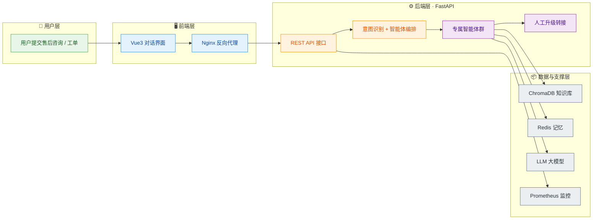

# 售后工单分流多智能体系统

> AfterSales Multi-Agent System · 基于 FastAPI 的售后工单自动分流与智能应答系统
> 本仓库为学习演示项目，未包含任何商业敏感数据。

## 项目简介

本系统支持售后工单的自动分流与智能应答，提供了多智能体协作、知识库问答、多轮记忆、监控评测与 Docker Compose 一键部署等能力。

## 核心特性

- **意图识别**：LLM 语义理解（70%）+ Embedding 向量匹配（20%）+ 关键词兜底（10%）三路融合加权投票，并输出紧急程度分级
- **多智能体路由**：意图路由 → 性能路由（选成功率/延迟最优）→ 降级路由（专属 Agent 不可用时回退通用 Agent）
- **专属智能体**：售后账单 Agent、技术支持 Agent、通用客服 Agent、人工升级 Escalation
- **RAG 知识库**：ChromaDB 向量检索，支持查询改写、并行召回、重排与降级兜底
- **多级记忆**：Redis 工作记忆（最近对话）+ ChromaDB 情景记忆 / 用户画像
- **Skill 动态注入**：业务处理规范以 SKILL.md 维护，运行时热加载
- **监控与评测**：Prometheus 指标、Agent 成功率监控、端到端对话评测
- **一键部署**：Docker Compose 编排 Redis / ChromaDB / Prometheus / 后端 / Nginx

## 系统架构



### 一次售后请求的处理流程

```text
用户消息 → 读取记忆上下文 → 意图识别 → 智能体路由分流 → 专属 Agent 处理（可选 RAG 检索）
        → 写入记忆 / 异步更新用户画像 → 返回响应（意图、Agent 类型、是否升级、耗时）
```

## 技术栈

| 层级 | 技术 |
| --- | --- |
| 前端 | Vue 3 · Vite 7 · Nginx |
| 后端 | Python 3.12 · FastAPI · Uvicorn · Pydantic |
| AI | Anthropic Claude API（兼容 DeepSeek 等第三方 Anthropic 协议接口） |
| 数据 | Redis 7（工作记忆） · ChromaDB 0.5（向量知识库 / 长期记忆） |
| 监控 | Prometheus |
| 部署 | Docker · Docker Compose |

## 目录结构

```text
aftersales-multiagent-system/
├── api/                        # FastAPI 入口与全部 REST 接口
├── agents/                     # 智能体编排器（路由 / 并行 / 降级 / 升级）
├── core/                       # 意图识别、LLM 工具、Skill 加载
├── mcp/                        # 知识库 RAG 与工具管理
├── memory/                     # Redis + ChromaDB 多级记忆
├── monitor/                    # Prometheus 性能监控
├── evaluation/                 # 端到端评测
├── skills/                     # 业务规范（SKILL.md，热加载）
├── config/                     # Nginx / Prometheus 部署配置
├── data/demo_docs/             # 示例知识文档
├── src/                        # 前端 Vue3 + Vite 对话界面（与后端同仓）
├── Dockerfile
└── docker-compose.yml
```

## 快速开始

### 方式一：Docker Compose 一键部署（推荐）

```bash
cp .env.example .env      # 填入 ANTHROPIC_API_KEY
docker compose up -d --build
```

启动后服务：

| 服务 | 地址 |
| --- | --- |
| 后端 API / Swagger 文档 | http://localhost:8000 · http://localhost:8000/docs |
| Nginx 反向代理（80 端口） | http://localhost |
| ChromaDB 向量库 | http://localhost:8001 |
| Prometheus | http://localhost:9090 |

### 方式二：本地开发

后端：

```bash
python -m venv .venv
pip install -r requirements.txt
cp .env.example .env
uvicorn api.main:app --reload
```

前端：

```bash
npm install
npm run dev      # http://localhost:5173，/api/python 自动代理到后端 8000
```

## 主要 API 接口

| 方法 | 路径 | 说明 |
| --- | --- | --- |
| POST | `/chat` | 主对话接口：记忆读取 → 意图识别 → Agent 分流 → 执行 → 记忆写入 |
| GET | `/health` | 健康检查与 Agent 运行统计 |
| GET | `/skills` | 查看已加载的 Skills |
| POST | `/skills/reload` | 运行时热加载 Skills |
| POST | `/search` | 知识库检索（查询改写 → 召回 → 重排） |
| POST | `/knowledge/add` | 批量导入知识文档 |
| POST | `/knowledge/upload` | 上传 txt / md / json 文件导入知识库 |
| GET | `/knowledge/stats` | 知识库文档片段统计 |
| GET | `/monitor` | 监控摘要（成功率、工具统计、告警） |
| GET | `/metrics` | Prometheus 指标 |
| POST | `/eval/run` | 运行端到端评测用例 |

## 环境变量

关键配置项见 `.env.example`，主要包括：

- `ANTHROPIC_API_KEY`：LLM 接口密钥（必填）
- `ANTHROPIC_BASE_URL`：可选，兼容 Anthropic 协议的第三方地址（如 DeepSeek）
- `ANTHROPIC_MODEL`：模型名称
- `REDIS_URL` / `REDIS_PASSWORD`：Redis 连接
- `CHROMA_HOST` / `CHROMA_PORT`：ChromaDB 连接
- `AFTERSALES_SKILLS_DIR`：Skills 目录

## 说明

- 本仓库为个人学习与演示用途（open-source simplified），未包含真实业务数据、密钥或未授权代码。
- 启动前必须复制 `.env.example` 为 `.env` 并填写自己的 `ANTHROPIC_API_KEY`。